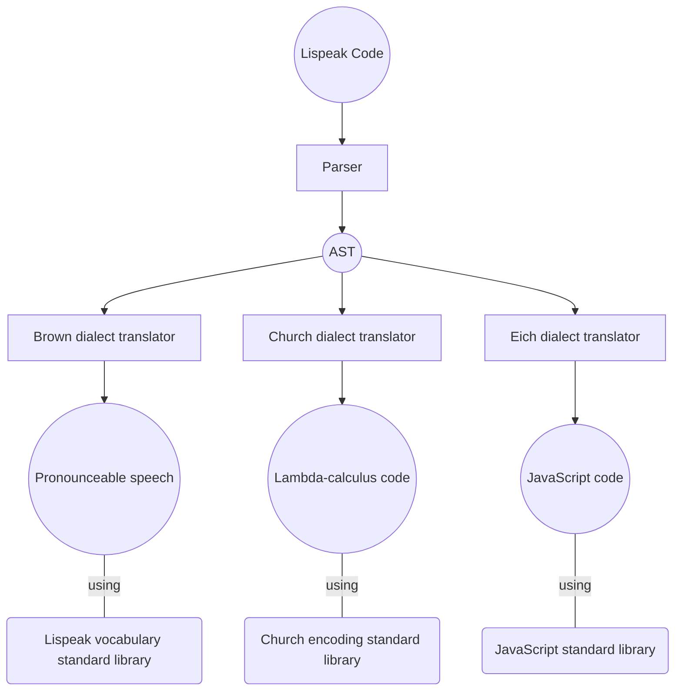

# Lispeak

LISP you can speak!

## Inspiration

Lispeak is inspired by:

- [Lambda-calculus](https://en.wikipedia.org/wiki/Lambda_calculus)
- [Lisp](https://en.wikipedia.org/wiki/Lisp)
- [Lojban](https://en.wikipedia.org/wiki/Lojban)
- [Group theory](https://en.wikipedia.org/wiki/Group_theory)

Originally the idea of this language was described and explained in [this post](https://habr.com/ru/articles/902574) of mine (in Russian)

## Features

The goal of the project is to create a language that you can speak on and compile at the same time.

- Language specification should be stored in git and developed by pull requests
- Language specification should be described in TypeScript and to be based on functions
- Every sentence should be an S-expression
- Every sentence should be pronouncable
- Every sentence should be executable on computer
- Language should sound well
- Language should be fully compatible with words from any other natural language

## Architecture

Lispeak has three a bit different dialects that can be translated to speech, lambda-calculus or JavaScript.

## Specs

- [Alphabet](./specs//01_alphabet.md)
- [Syntax](./specs//02_syntax.md)

## Symmetry

Lispeak is based on ideas of groups and symmetries from the group theory.  
Every meaning in Lispeak should be a group:

- It should have neutral element (identity)
- It should have negation operation (not)

Neutral element and negation has phonetic difference.  
Letter `y` works as negation operation for vowels - so the same word but starting with `o` and starting with `yo` have opposite meanings.

## Morphology

The basic idea of Lispeak morphology is phonetic symmetry using pair sounds like `a` and `ya` or `f` and `v` for symmetric meanings like `left` and `right`, `beautiful` and `ugly`, `subject` and `object`, `cold` and `hot`. It will be based on something similar to consonant roots and binyanim in Hebrew.

## Digits and Numerals

Digits in Lispeak are based on vowels in alphabetic order:

| Digit | Lispeak | Russian Pronunciation |
| ----- | ------- | --------------------- |
| 0     | `an`    | `ан`                  |
| 1     | `en`    | `эн`                  |
| 2     | `in`    | `ын`                  |
| 3     | `on`    | `он`                  |
| 4     | `un`    | `ун`                  |
| 5     | `yan`   | `ян`                  |
| 6     | `yen`   | `ен`                  |
| 7     | `yin`   | `ин`                  |
| 8     | `yon`   | `ён`                  |
| 9     | `yun`   | `юн`                  |

To construct a numeral combine first sounds of digits with `'` separator:

| Number | Lispeak          | Russian Pronunciation |
| ------ | ---------------- | --------------------- |
| 12     | `en'ina`         | `эн-ына`              |
| 586    | `yan'yon'yena`   | `ян-ён-ена`           |
| 9470   | `yun'un'yin'ana` | `юн-ун-ин-ана`        |
